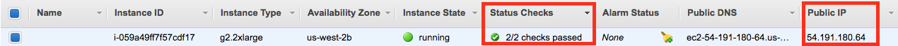

# traffic-sign-classifier

Overview
---
In this project, you will use what you've learned about deep neural networks and convolutional neural networks to classify traffic signs. You will train and validate a model so it can classify traffic sign images using the [German Traffic Sign Dataset](http://benchmark.ini.rub.de/?section=gtsrb&subsection=dataset). After the model is trained, you will then try out your model on images of German traffic signs that you find on the web.

Setting up enviroment
---
**CarND Starter Kit**

Install the car nanodegree starter kit if you have not already done so: [CarND Term1 Starter Kit](https://github.com/udacity/CarND-Term1-Starter-Kit/blob/master/README.md)

**TensorFlow**
If you have access to a GPU, you should follow the TensorFlow instructions for installing [TensorFlow with GPU support](https://www.tensorflow.org/install/#optional_install_cuda_gpus_on_linux)

**Amazon Web Services**
1. Launch an Instance

Visit the EC2 Management [Console](https://us-west-1.console.aws.amazon.com/ec2/v2/home?region=us-west-1#Home:), click "Launch Instance", choose "Community AMIs", search for the “**udacity-carnd**” AMI and click "select".

2. Select the Instance type

Filter the instance list to only show “GPU instances”, select the **g2.2xlarge** instance type. Finally, click on the “Review and Launch” button. Then increase the storage size to 16 GB (or more, if necessary, I choose 32 GB).

3. Configure the Security Group

Most of these configurations are already set up on the udacity-carnd AMI. However, you must also configure the security group correctly when you launch the instance.

By default, AWS restricts access to most ports on an EC2 instance. In order to access the Jupyter notebook, you must configure the AWS Security Group to allow access to port **8888**.

Click on "Edit security groups", then set:
* Select "Create a new security group"
* Set the "Security group name" (i.e. "Jupyter")
* Click "Add Rule"
* Set a "Custom TCP Rule"
* Set the "Port Range" to "8888"
* Select "Anywhere" as the "Source"
* Click "Review and Launch" (again)

4. Launch the Instance

Click on the “Launch” button to launch your GPU instance!

5. Proceed Without a Key Pair

In this case the AMI has a pre-configured user account and password, so you can select “**Proceed without a key pair**” and click the “Launch Instances” button (for real this time!).

Next, click the “View Instances” button to go to the EC2 Management Console and watch your instance boot.

6. Stop and terminate

From this point on, AWS will charge you for a running an EC2 instance.

Most importantly, remember to “**stop**” (i.e. shutdown) your instances when you are not using them. Otherwise, your instances might run for a day or a week or a month without you remembering, and you’ll wind up with a large bill!

AWS charges primarily for running instances, so most of the charges will cease once you stop the instance. However, there are smaller storage charges that continue to accrue until you “**terminate**” (i.e. delete) the instance.

7. Log in

After launch, your instance may take a few minutes to initialize. Once you see “2/2 checks passed” on the EC2 Management Console, your instance is ready for you to log in.

Note the "Public IP" address (in the format of “X.X.X.X”) on the EC2 Dashboard.

From a terminal, SSH to that address as user “carnd”:

`> ssh carnd@X.X.X.X`

Authenticate with the password: carnd

8. Launch a Jupyter nootbook

Congratulations! You now have a GPU-enabled server on which to train your neural networks.

On the EC2 instance:

* Clone the LeNet Lab repo:

`> git clone https://github.com/udacity/CarND-LeNet-Lab.git`

* Enter the repo directory:

`> cd CarND-LeNet-Lab`

* Activate the new environment:

`> source activate carnd-term1`

* Run the notebook:

`> jupyter notebook LeNet-Lab-Solution.ipynb`

9. Run the jupyter notebook

From your local machine:

* Access the Jupyter notebook index from your web browser by visiting: X.X.X.X:8888 (where X.X.X.X is the IP address of your EC2 instance)

* Click on the "LeNet-Lab-Solution.ipynb" link to launch the LeNet Lab Solution notebook

* Run each cell in the notebook
