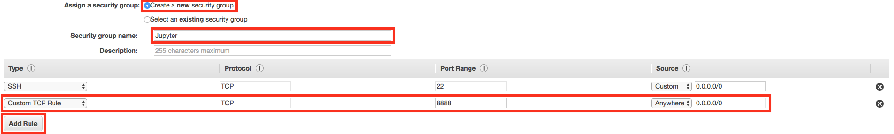

# traffic-sign-classifier

Overview
---
In this project, you will use what you've learned about deep neural networks and convolutional neural networks to classify traffic signs. You will train and validate a model so it can classify traffic sign images using the [German Traffic Sign Dataset](http://benchmark.ini.rub.de/?section=gtsrb&subsection=dataset). After the model is trained, you will then try out your model on images of German traffic signs that you find on the web.

Setting up enviroment
---
**CarND Starter Kit**

Install the car nanodegree starter kit if you have not already done so: [CarND Term1 Starter Kit](https://github.com/udacity/CarND-Term1-Starter-Kit/blob/master/README.md)

**TensorFlow**
If you have access to a GPU, you should follow the TensorFlow instructions for installing [TensorFlow with GPU support](https://www.tensorflow.org/install/#optional_install_cuda_gpus_on_linux)

**Amazon Web Services**
1. Launch an Instance

Visit the EC2 Management [Console](https://us-west-1.console.aws.amazon.com/ec2/v2/home?region=us-west-1#Home:), click "Launch Instance", choose "Community AMIs", search for the “**udacity-carnd**” AMI and click "select".

2. Select the Instance type

Filter the instance list to only show “GPU instances”, select the **g2.2xlarge** instance type. Finally, click on the “Review and Launch” button. Then increase the storage size to 16 GB (or more, if necessary, I choose 32 GB).

3. Configure the Security Group

Most of these configurations are already set up on the udacity-carnd AMI. However, you must also configure the security group correctly when you launch the instance.

By default, AWS restricts access to most ports on an EC2 instance. In order to access the Jupyter notebook, you must configure the AWS Security Group to allow access to port 8888.

Click on "Edit security groups", then set:
* Select "Create a new security group"
* Set the "Security group name" (i.e. "Jupyter")
* Click "Add Rule"
* Set a "Custom TCP Rule"
* Set the "Port Range" to "8888"
* Select "Anywhere" as the "Source"
* Click "Review and Launch" (again)

